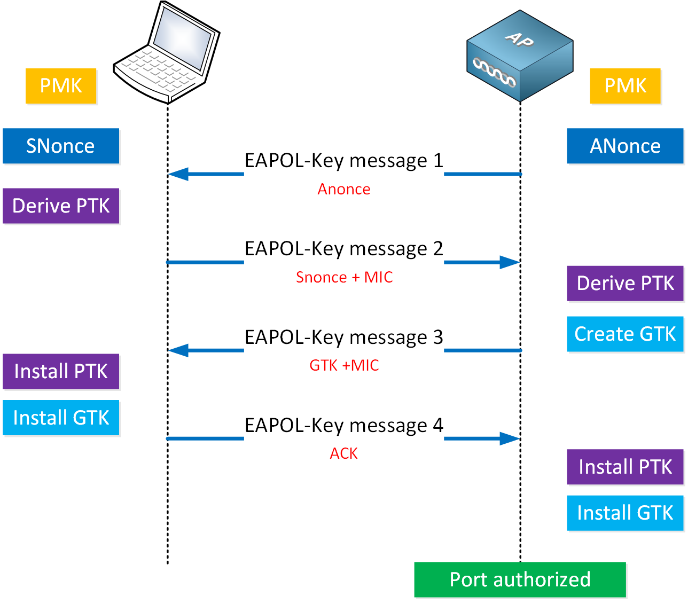

# WI-FI

## Niveau de signal

* Mesuré en décibels comparé à un milliwatt (dBm)
* \-50 dBm à -65 dBm généralement recommandé
* Doit être supérieur au bruit de fond (SNR)
* Doit être équilibré des deux cotés (client/point d'accès)
* Peut être trop élevé
* 1 milliwatt = 0 dBm&#x20;

## Décibels

Logarithmique = non-linéaire

* \+3 dBm -> Double le signal
* \-3 dBm -> Réduit le signal de moitié
* \+10 dBm -> Signal 10x plus fort
* \-10 dBm -> Signal 10x moins fort

## Interférence

### Bruit de fond (noise floor):

Toute activité sur la même fréquence autre que notre réseau

* Bluetooth
* Micro-Ondes
* Radars
* Micros/hauts parleurs sans fil
* Etc.

### Rapport de signal au bruit de fond:

Écart entre le bruit de fond et la force du signal reçu&#x20;

### Temps d'antenne (airtime):

Le pourcentage du temps d'utilisation du point d'accès sans fil par d'autres clients. Il ne faut pas oublier que l'ensemble d'un réseau sans fil est un seul domaine de collision.

## Fréquences

### Bande de fréquences:

Séquence continue de fréquences utilisables par une technologie&#x20;

Wi-FI (diffère selon leur la génération):

* 900 MHz
* 2.4GHz
* 5GHz
* 6GHz
* 45GHz
* 60GHz

Canaux: Une division d'une bande fréquence. On peut ici penser à des stations de radio, des canaux télévisés ou des points d'accès sans fil.

Il est défini par sa fréquence centrale et par sa largeur. 10,20 ou 40 MHz en 2.4 GHz. 20,40 ou 80 MHz en 5GHz.

<figure><figcaption>
2.4 GHz (20MHz) - PowerPoint de Alexandre Arsenault-Jetté
</figcaption></figure>

## Authentification

### SSID&#x20;

Divisé en deux types principaux.

* ESSID -> Nom du réseau
* BSSID -> MAC du point d'accès

### Balise

Lorsqu'un point d'accès (AP) annonce son réseau. Même lorsqu'un réseau est masqué, il annonce son BSSID

### Ouvert

Sans mot de passe, trafic non encrypté

### "Ouvert amélioré"

Sans mot de passe, utilise "OWE" pour encrypter le trafic entre le point d'accès et chaque client

### Portail captif

Sans mot de passe, authentification web

### Clé prépartagée

Mot de passe partagé par tous les clients du réseau, comme votre réseau domestique

### (EAP) Protocole d’authentification étendu &#x20;

Utilise un serveur distant d'authentification pouvant authentifier un client par un certificat ou par un nom d'utilisateur et mot de passe, comme le wifi "CAT"

### Séquence d'authentification

<figure><figcaption>
4-way handshake - Source: <a data-mention href="../../../sources.md#wi-fi">#wi-fi</a>
</figcaption></figure>

## Rôles

### Point d'accès (AP)

Diffuse un réseau, accueille des clients

### Station

Se connecte à un point d'accès

### Maillé (WDS)

Toutes les radios peuvent s'interconnecter et établir le chemin de sortie le plus efficace. Chaque radio peut servir de lien en amont si elle se situe plus près d'un point de sortie du réseau maillé.

## Générations



2.4 GHz seulement, jusqu'à 54Mbps en SISO[^1]



2.4 et 5GHz jusqu'à 150Mbps par radio, 600Mbps en MIMO[^2]



5GHz jusqu'à 1.7Gbps en MIMO[^3]



5GHz jusqu'à 2.4Gbps en MIMO[^4]



6GHz jusqu'à 40Gbps en MIMO[^5]



## Wi-Fi 6/AX

Sépare son canal en sous-canaux pour communiquer avec plusieurs appareils simultanément

[^1]: Single Input Single Output

[^2]: Multiple Input Multiple Output

[^3]: Multiple Input Multiple Output

[^4]: Multiple Input Multiple Output

[^5]: Multiple Input Multiple Output
